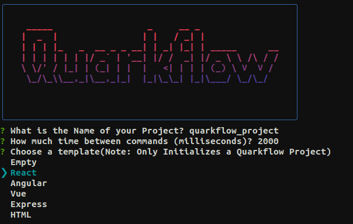
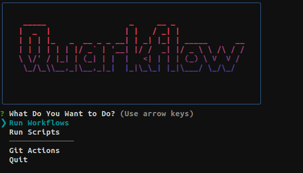

<div align="center">
  
</div>


# Quarkflow Command Line Interface (CLI) Documentation

**Version**: 0.0.1

## Introduction

The Quarkflow CLI is a developer-friendly workflow management tool designed to streamline various tasks and workflows. This documentation provides an overview of the CLI commands and their usage.

## Installation

To install Quarkflow, follow these steps:

1. **Install Node.js**: Ensure you have Node.js installed on your system.

2. **Install Quarkflow**: Use npm to install Quarkflow globally:

   ```sh
   npm install -g quarkflow
   ```

3. **Verify Installation**: To verify that Quarkflow is installed correctly, run the following command:

   ```sh
   quarkflow --version
   ```

## Commands

### `quarkflow init [options] <dir>`

- **Description**: Initialize a Quarkflow project in the specified directory.
- **Options**:
  - `-f, --force`: Forcefully create an empty project.



### `quarkflow`

- **Description**: Run Quarkflow interactive mode, invoking the interactive menu.

### `quarkflow --script <script-name>`

- **Description**: Run a Quarkflow script non-interactively.

### `quarkflow --workflow <workflow-name>`

- **Description**: Run a Quarkflow workflow non-interactively.

### `quarkflow version`

- **Description**: Display the version of Quarkflow.

## Interactive Menu

Quarkflow provides an interactive menu for managing workflows, scripts, Git-related tasks, and more. To access the menu, simply run the `quarkflow` command without additional arguments.



### Menu Structure

The interactive menu allows you to perform various tasks:

1. **Run Workflows**: Execute your own workflows.
2. **Run Scripts**: Run your custom scripts.
3. **Git Actions**: Perform Git operations.
4. **Quit**: Exit Quarkflow.

### Git Actions

From the interactive menu, you can access the Git module and run Git commands interactively.

#### Supported Git Commands

- `Branch`: View or manipulate branches.
- `Diff`: View changes between commits, branches, etc.
- `Log`: View commit logs.
- `Checkout`: Switch branches or restore working tree files.
- `Clean`: Remove untracked files from the working tree.

To use the Git module:

1. Select `Git Actions` from the main menu.
2. Choose a Git command from the menu.
3. Follow the prompts to execute the selected Git command.

### Configuration File

The Quarkflow configuration file (`.quarkflow/config.json`) serves as the heart of your project's settings, defining workflows, scripts, environment variables, and more. This section provides an overview of the key components of the configuration file and how to use them effectively.

#### Example Configuration

Here's an example of a Quarkflow configuration file:

```json
{
  "name": "quarkflow_project",
  "version": "0.0.1",
  "sleep": "1000",
  "workflows": {
    "dev": {
      "desc": "Development Workflow",
      "commands": [],
      "pre-run": [],
      "post-run": [],
      "env": {},
      "webhook": ""
    }
  },
  "scripts": {
    "push": "git push -u {origin} {branch}"
  },
  "env": {
    "branch": "master",
    "origin": "user@remoteserver.com"
  }
}
```

#### Configuration Components

The Quarkflow configuration file consists of the following key components:

- `"name"`: The name of your Quarkflow project.
- `"version"`: The version of your project.
- `"sleep"`: The sleep duration (in milliseconds) between commands.

##### Workflows

Workflows define sequences of commands and actions to be executed within your project. They include the following properties:

- `desc`: A description of the workflow.
- `commands`: An array of commands to be executed as part of the workflow.
- `pre-run`: An array of commands to run before the main commands of the workflow.
- `post-run`: An array of commands to run after the main commands of the workflow.
- `env`: Environment variables specific to this workflow.
- `webhook`: A webhook URL that will be triggered after the workflow finishes running.
- `concurrent`: If Set to `true` the main commands of the workflow will be run concurrently

#### Note:

- Using the `concurrent` property on a workflow that has alot of commands or multiple commands that require large amounts of processing power may cause the environment to crash.
- Keep in mind that when `concurrent` is set to `true` that sleep will become ineffective.

##### Scripts

Scripts define custom commands that you can execute within your project. They can include placeholders for dynamic values. For example:

```json
"scripts": {
  "push": "git push -u {origin} {branch}"
}
```

In this script, `{origin}` and `{branch}` are placeholders that will be replaced with values from the global environment variables.

Scripts Can Also be Run as a part of any Workflow as a `Pre-Run`, `Post-Run` or a `Main Command`.
For Example: 
```json
"workflows": {
  "dev":{
    "pre-run": [
      "lint",
      "set-port",
      "cp {sample} {env}"
    ],
    "commands": [
      "run",
      "echo Server Ran on Port {port}"
    ],
    "post-run":[
      "push"
    ], 
    "env":{
      "sample":".env.sample",
      "env":".env"
    },
  }
},
"scripts": {
  "lint": "eslint .",
  "run": "nodemon app.js",
  "set-port":"export PORT={port}",
  "push": "git push origin master"
},
"env": {
  "port": "3000"
}
```

##### Global Environment Variables

Global environment variables provide a convenient way to define variables that can be accessed across all workflows, scripts, and project settings. These variables help streamline your project's configuration and ensure consistency.

For example:

```json
"env": {
  "branch": "master",
  "origin": "user@remoteserver.com"
}
```

#### Usage

The Quarkflow configuration file allows you to customize and orchestrate various aspects of your project. You can define workflows, scripts, and environment variables to automate tasks, streamline processes, and maintain consistency.

## Conclusion

The Quarkflow CLI is a versatile tool for managing workflows, scripts, Git-related tasks, and more. Refer to the provided commands and examples to get started with Quarkflow.
